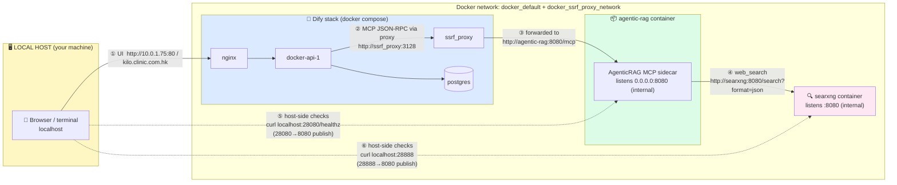

# Network Topology — Dify ↔ AgenticRAG ↔ Host

Who talks to whom, on which port, and why. Read this before touching any port.

## Connection diagram

## Connection matrix

| # | From | To | Address | Path type |
|---|---|---|---|---|
| ① | You (browser) | Dify nginx | `10.0.1.75:80` / `kilo.clinic.com.hk` | Host → published port |
| ② | Dify api | ssrf_proxy | `ssrf_proxy:3128` | Container → container (Docker DNS) |
| ③ | ssrf_proxy | **agentic-rag** | `http://agentic-rag:8080/mcp` | Container → container — **the MCP path** |
| ④ | agentic-rag | searxng | `http://searxng:8080` | Container → container |
| ⑤ | You (terminal) | **agentic-rag** | `localhost:28080` → maps to container 8080 | Host → published port only |
| ⑥ | You (terminal) | searxng | `localhost:28888` → maps to container 8080 | Host → published port only |

## The two rules this encodes

1. **Dify never touches the host ports.** Its path (②→③) runs entirely inside the
   Docker networks using container DNS names and the *internal* port **8080**.
   That is why the Dify UI URL is `http://agentic-rag:8080/mcp`, and why changing
   the host port to 28080 required zero Dify changes.
2. **28080 / 28888 are host-only windows.** They exist solely so you can reach the
   containers from the host terminal/browser. Removing those publish mappings
   would not affect Dify at all.

## Port reference card

| Path | Address | Note |
|---|---|---|
| Dify UI → sidecar (registered in Dify) | `http://agentic-rag:8080/mcp` | never 28080, never localhost |
| Host → sidecar | `http://localhost:28080/healthz` | 28080 avoids the crowded 8080 |
| Sidecar → SearXNG | `http://searxng:8080` (config `[web.searxng] url`) | container DNS |
| Host → SearXNG | `http://localhost:28888` | JSON API test: `/search?q=t&format=json` → 200 |

## Troubleshooting quick hits

| Symptom | Meaning | See |
|---|---|---|
| `agentic-rag:28080` refused from a container | Wrong path — internal port is 8080 | matrix ③ |
| `localhost:8080` refused on host | Host port freed deliberately | use 28080 (matrix ⑤) |
| Dify "Cannot connect to MCP server" | SSRF allowlist missing | `DEPLOY.md` Step 4.2 |
| Dify edit-save → 500 | Dify identifier-vs-UUID bug — delete + re-add | `DEPLOY.md` Step 4.5 |
